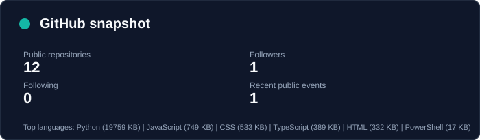
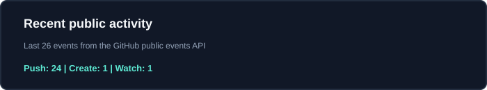

# Vu Duc Quang

### ICT student building practical AI systems

  
  

<em>Artificial Intelligence | Machine Learning | Computer Vision | Deep Learning | Software Development</em>

## About

I am a second-year ICT student at the University of Science and Technology of Hanoi, focused on turning coursework and experiments into useful, deployable software. My current work explores speech AI, large language model applications, and retrieval-augmented generation.

## Current Focus

| Area | What I am working on |
| --- | --- |
| AI systems | Speech processing, LLM applications, RAG, and model evaluation |
| Engineering | Reliable APIs, asynchronous workloads, data storage, and secure integrations |
| Learning next | MLOps, AI deployment, agentic AI, and production observability |

## Tech Stack

**AI / ML**  `Python` `PyTorch` `scikit-learn` `Whisper` `LLMs` `RAG`

**Backend / Data**  `FastAPI` `Flask` `PostgreSQL` `pgvector` `Redis` `FFmpeg`

**Frontend / Platform**  `React` `Vite` `Docker` `Git` `GitHub Actions`

## Featured Projects

### [VietMeet AI](https://github.com/QuangVuDuc006/VietMeet-ai)

Vietnamese meeting intelligence that turns audio recordings into timestamped transcripts and structured meeting knowledge.

- Asynchronous speech-processing pipeline with FastAPI, PostgreSQL, and background workers
- Audio preprocessing, voice activity detection, and bounded chunking
- Evaluation on 100 VIVOS samples: **21.75% normalized WER**, **10.67% normalized CER**, and **0.087 real-time factor**
- React interface for upload, processing progress, and transcript review

`Python` `FastAPI` `Whisper` `React` `PostgreSQL` `FFmpeg` `Docker`

### [Nexa AI Workspace](https://github.com/QuangVuDuc006/Nexa-AI-Workspace-)

A self-hosted AI workspace for chatting with multiple LLM providers and working securely with personal documents.

- Multi-provider LLM architecture with streaming responses
- PostgreSQL and pgvector RAG pipeline with citations and conversation memory
- Encrypted BYOK management, tenant isolation, file validation, and rate limiting
- Automated security tests around document and API-key handling

`Python` `Flask` `React` `PostgreSQL` `pgvector` `Redis` `Docker`

## GitHub Snapshot

  
   
  

The two SVGs above are generated weekly by [`.github/workflows/update-metrics.yml`](./.github/workflows/update-metrics.yml). They are committed as generated assets, so the profile remains fast and does not depend on a third-party dashboard at render time.

## Goals

- Ship small AI products with measurable quality and clear failure modes
- Strengthen deployment, evaluation, and MLOps fundamentals
- Contribute to open-source projects and collaborate on practical AI engineering

## Contact

The best way to reach me is [vuducquangbin@gmail.com](mailto:vuducquangbin@gmail.com). More project work is available in my [repositories](https://github.com/QuangVuDuc006?tab=repositories).
